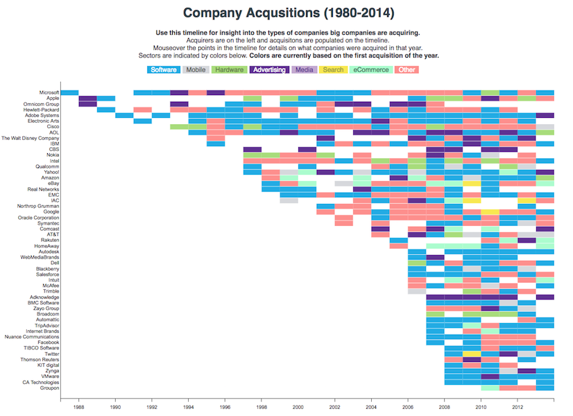

# Company Acquisition Timeline
This project is a data visualization of company acquisitions using D3js. We used R to analyze the data and created a timeline that displays the acquired companies by sector.

[Link to Timeline](https://hovsepa.github.io/company-acquisitions-01/)

## Future iterations will dig deeper into acquisition patterns and explore telling individual company acquisition stories.
Though a timeline has its advantages, it is not able to capture the scope of data for each company. I will be experimenting different modes of visualization to tell different aspects of each story.